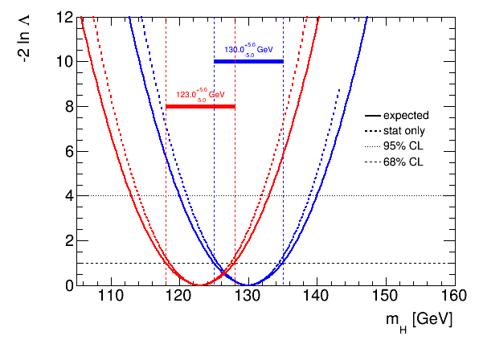

# PyROOTUtils

Python utilities for ROOT. This package provides some convenience classes for ROOT. It comes with a default style (which is much prettier than ROOT's default) and helps making fixed-font-size-legends, graphs, bands, markers and horizontal and vertical lines. It also has a function for multi-line text. 

It also has a utils package for `ModelConfig` -- `ModelConfigUtils` -- that is intended to be used in python scripts with `optparse` to apply model transformations given on the command line on the fly.

Alignment options for text and legends are more intuitive, for example: `halign="right"`, `valign="bottom"` is translated into ROOT's number codes that represent the alignment.

# Install

Setup your `virtualenv` and install this package from git

```
pip install git+https://github.com/svenkreiss/PyROOTUtils.git
```

# Simple Example

[.py source](example.py),
[svg](doc/example.svg),
[eps](doc/example.eps),
[png](doc/example.png)
... use eps for higher quality.



